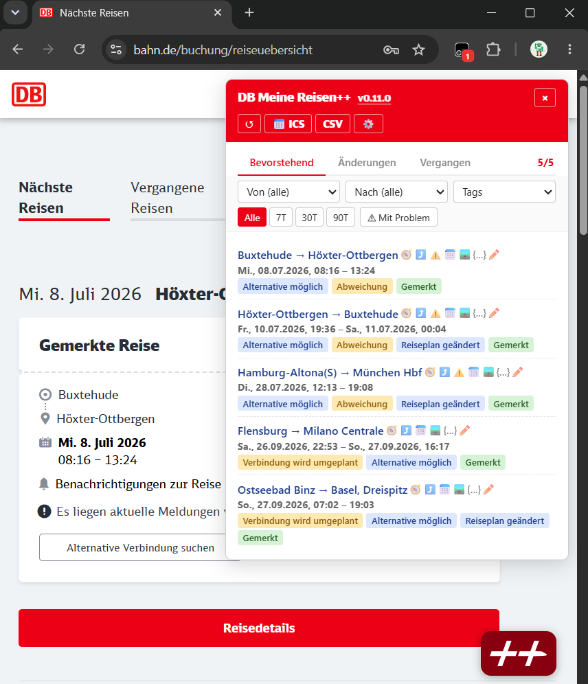

[Deutsch](README.de.md)

# DB Meine Reisen++

A userscript that improves Deutsche Bahn's "Meine Reisen" ("My Trips") page with a better overview, change tracking, and data export.

## What it does

**Full Trip Overview**
- Shows all your trips (upcoming and past) in one list, no pagination
- Displays departure platform, ticket type, and seat reservations directly in the list — reduces need to open each trip individually
- Optional links to external train info and routing sites (zugfinder.net, bahn.expert, chuchuu.com, transitous.org)

**Change Tracking**
- Compares your trips across visits and highlights what has changed: delays, cancellations, reroutings, platform changes

**Past Trip Details**
- Optionally enriches past trips with additional information captured during earlier visits (lifted train binding, delays, seat info, and more)
- This data is stored in your browser only; it builds up over time as you use the script

**Data Export**
- Export trips to a calendar (ICS)
- Export all trips as a CSV spreadsheet
- Download PDF tickets directly
- Export routes as GPX or GeoJSON
- Download the raw trip data as JSON
- Import/export your settings and change history as a bundle

**Sync**
- Sync your history, tags, and notes across browsers via WebDAV (e.g. Nextcloud, any WebDAV server)
- Push trips as calendar events to any CalDAV calendar (e.g. Nextcloud, iCloud) — push only, changes in the calendar are not read back

**Filtering**
- Filter by origin or destination station
- Filter by date range (past 7 / 30 / 90 days, or all)
- Show only trips with issues
- Filter by tags and indicators
- Separate tabs for upcoming and past trips

**Tags & Indicators**
- First class
- Rerouting required
- Connection being replanned
- Train binding (Zugbindung)
- Subscription trips
- Cancelled seats or bike reservations
- Disruptions
- Muted alerts
- Custom tags

**German & English**
- German on bahn.de, English on int.bahn.de

---

## Installation

1. **Install a userscript manager** such as [Tampermonkey](https://tampermonkey.net/), [Violentmonkey](https://violentmonkey.github.io/), or [Greasemonkey](https://www.greasespot.net/)

2. **Install the script:** [Install DB Meine Reisen++](https://raw.githubusercontent.com/Jo11n/db-meine-reisen-plus-plus/main/db-meine-reisen-plus-plus.user.js) — your userscript manager will ask you to confirm

3. **Open it:** go to [bahn.de/meine-reisen](https://www.bahn.de/meine-reisen) and click the floating ++ button in the lower right corner

---

## Privacy & Security

**Unofficial — use at your own risk.**

- Runs entirely in your browser; no data leaves your device by default
- Only calls Deutsche Bahn's own APIs (the same ones the website uses) by default
- No tracking, no third-party servers (external services only linked to); if you enable WebDAV or CalDAV sync, data is sent to the server you configure
- All snapshots and settings are stored locally in your browser

---

## Limitations

- **CalDAV push is one-directional** — events pushed to your calendar are never read back; deletions or edits in the calendar are ignored
- **Read-only** — the script never makes bookings or changes anything on your account
- **Change tracking is best-effort** — it only catches what DB's API exposes; some changes may go undetected
- **Tied to your browser** — saved data stays in the browser you use it in; switching browsers starts fresh. bahn.de and int.bahn.de do not share data automatically (use the export/import bundle to transfer)
- **Past trip enrichment builds up over time** — it's off by default and only shows data from visits you've already made
- **Some ticket types or flags may not be recognized** — the API is undocumented, so unusual cases may be missed
- **External links have edge cases** — train number and routing links don't always work perfectly
- **Not optimized for mobile** — the panel may look rough on small screens

---

## Feedback & Issues

[Report a bug or suggest a feature](https://github.com/Jo11n/db-meine-reisen-plus-plus/issues)

## License

[MIT License](LICENSE)
